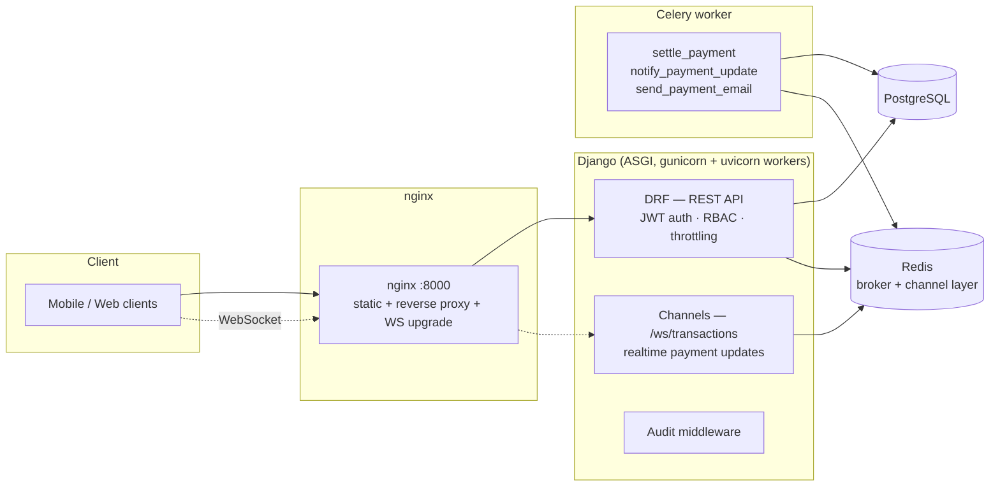

# NovaBank API

**Business e-banking platform API** — Django · DRF · PostgreSQL · Celery · Redis · Channels

A portfolio backend built to production standards: JWT/OAuth2-style auth with rotating
refresh tokens, role-based access control for business organizations, **idempotent
payments** on a **double-entry ledger**, virtual card issuance, customer-scoped PDF
statements, realtime updates over WebSocket, and an audit trail on every mutating call —
all under CI with a 90% coverage test suite.

> Fictional product, real practices. Built by [Hossam Rakha](https://github.com/hossam1244)
> to demonstrate banking-grade backend engineering. No real bank was involved. 🙂

[](https://github.com/hossam1244/novabank-api/actions/workflows/ci.yml)
[](https://www.python.org/)
[](https://www.djangoproject.com/)
[](LICENSE)

---

## Quickstart

### Full stack with Docker (recommended)

```bash
docker compose up --build
```

That boots PostgreSQL, Redis, a Celery worker, gunicorn (ASGI) and nginx, runs
migrations, seeds demo data and serves everything on **http://localhost:8000**.

Open the interactive API docs:

* **Swagger UI** → http://localhost:8000/api/swagger/
* ReDoc → http://localhost:8000/api/redoc/

Seeded demo logins (password for all: `Passw0rd!demo`):

| User | Role |
|---|---|
| `owner@novabank.demo` | owner |
| `admin@novabank.demo` | admin |
| `employee@novabank.demo` | employee |

### Local development without Docker

```bash
make install          # uv venv + dependencies
make dev              # SQLite + in-memory channels; Celery eager via env
make seed             # demo data
```

### A 60-second tour

```bash
TOKEN=$(curl -s -X POST http://localhost:8000/api/v1/auth/token/ \
  -H 'Content-Type: application/json' \
  -d '{"email": "owner@novabank.demo", "password": "Passw0rd!demo"}' | python3 -c 'import sys,json;print(json.load(sys.stdin)["access"])')

# List accounts (note the seeded Main EUR balance)
curl -s http://localhost:8000/api/v1/orgs/<ORG_ID>/accounts/ -H "Authorization: Bearer $TOKEN"

# Pay a beneficiary — the Idempotency-Key header is REQUIRED on payments
curl -s -X POST http://localhost:8000/api/v1/orgs/<ORG_ID>/payments/ \
  -H "Authorization: Bearer $TOKEN" -H "Idempotency-Key: demo-1" \
  -H 'Content-Type: application/json' \
  -d '{"source_account": "<ACCOUNT_ID>", "amount": "25.00",
       "beneficiary_name": "ACME Supplier", "beneficiary_iban": "CY17002001280000001200527600",
       "reference": "Invoice 42"}'

# Retry the exact same request — same body, same key: you get the SAME payment
# back (status 201, Idempotency-Replayed: true) and the account is debited once.

# Download a PDF statement for the account
curl -s -o statement.pdf "http://localhost:8000/api/v1/orgs/<ORG_ID>/accounts/<ACCOUNT_ID>/statement.pdf" \
  -H "Authorization: Bearer $TOKEN"
```

Get your org id from `GET /api/v1/me/`.

## Architecture



Apps:

| App | Responsibility |
|---|---|
| `accounts` | User (email login), Organization, Membership + RBAC, JWT endpoints |
| `banking` | Accounts, payments + idempotency, double-entry ledger, cards, statements |
| `audit` | Append-only audit events: middleware floor + rich domain events |
| `notifications` | Channels consumer, Celery settlement & notification tasks |
| `core` | Shared error envelope, pagination, base exceptions |

## The design decisions that matter

### 1. Money movement is a double-entry ledger

Balances are **derived, not stored truth**: every settled payment posts exactly two
`LedgerEntry` rows (debit source, credit the org's internal clearing account) that sum
to zero, and `BankAccount.balance` is a cache updated inside the same transaction.
`services.verify_invariants()` re-derives every balance from the ledger — and tests
assert it after every movement. A DB check constraint additionally forbids operational
accounts from ever going negative.

### 2. Payments are idempotent — retries can't double-debit

`POST /payments` requires an `Idempotency-Key` header (Stripe-style). The first
response is stored; a retry with the same key + body is **replayed from storage**
(marked `Idempotency-Replayed: true`) without touching the ledger. Same key with a
*different* body → `409 idempotency_key_reused`. Definitive error responses (e.g.
`insufficient_funds`) are cached too, so flaky-network clients converge safely.
Concurrent duplicates race on a unique constraint — the loser replays the winner's
response.

### 3. RBAC with role hierarchy

`owner > admin > employee` — checked via weights (`at_least`), so an admin-granting
permission is automatically satisfied by owners. Enforcement happens in **queryset
scoping first** (a member of org A simply gets no rows from org B), with object-level
checks behind it. Last-owner protection prevents an org losing all owners.

### 4. State transitions are re-fetched under lock

`cancel_payment` re-reads the payment with `select_for_update` before deciding — the
caller's in-memory copy may be stale (a Celery settlement may have settled it a
moment ago). A settled payment can never be overwritten with `cancelled`. All balance
mutations lock the affected accounts (`select_for_update`) in one transaction.

### 5. Security posture

* JWT access tokens (15 min) + **rotating refresh tokens that blacklist on use**
* Scoped throttling: `auth` 10/min anonymous, `payments` 30/min per user (env-tunable)
* Card PANs are **never persisted** — Luhn-valid demo numbers shown once at issuance,
  only `last4` is stored
* Statements stream only to authenticated members of the owning org
* Audit middleware stores method/path/status/duration — never request bodies

## API surface

| Endpoint | Purpose |
|---|---|
| `POST /api/v1/auth/register/` | Create org + owner, get tokens |
| `POST /api/v1/auth/token/` · `/token/refresh/` · `/token/verify/` | JWT lifecycle |
| `GET /api/v1/me/` | Profile + memberships/roles |
| `GET·POST /api/v1/orgs/{org}/members/` | List / invite (admin+) |
| `PATCH·DELETE /api/v1/orgs/{org}/members/{id}/` | Role change (owner) / removal |
| `GET·POST /api/v1/orgs/{org}/accounts/` | List / open accounts |
| `POST /api/v1/orgs/{org}/accounts/{id}/deposits/` | Simulated inbound funds |
| `GET /api/v1/orgs/{org}/accounts/{id}/transactions/` | Cursor-paginated ledger |
| `GET /api/v1/orgs/{org}/accounts/{id}/statement.pdf` | Period statement PDF |
| `GET·POST /api/v1/orgs/{org}/payments/` | History / create (idempotent) |
| `POST /api/v1/orgs/{org}/payments/{id}/cancel/` | Cancel a pending payment |
| `GET·POST /api/v1/orgs/{org}/cards/` · `/{id}/freeze|unfreeze|cancel` | Virtual cards |
| `GET /api/v1/orgs/{org}/audit/` | Audit trail (admin+) |
| `WS /ws/transactions/?token=<jwt>` | Realtime payment updates |
| `/api/schema/` · `/api/swagger/` · `/api/redoc/` | OpenAPI + docs |

Every error response uses one envelope:

```json
{ "error": { "code": "insufficient_funds", "message": "…", "details": { "available": "5000.00" } } }
```

## Performance notes

* The transactions endpoint uses **cursor pagination** — offset pagination walks `OFFSET n`
  rows and breaks when new rows arrive between pages; a `(created_at, id)` cursor stays
  O(log n) and stable.
* List endpoints use `select_related`/`prefetch_related` so the N+1s stay out of the
  ledger view (which also renders the counterparty per entry).
* Composite indexes back the hot paths: `(organization, -created_at)` on accounts and
  payments, `(account, -created_at)` on ledger entries.
* Payment validation locks only the rows it needs (`select_for_update` on the source
  account), keeping concurrent payment paths from serializing on each other.

## Testing

```bash
make test       # 88 tests, in-memory SQLite locally
make coverage   # ~90% coverage
```

The suite covers: auth + refresh rotation/blacklisting, RBAC matrix (including
last-owner protection), org isolation (an outsider with a valid token gets 404s, not
data), payment lifecycle, **idempotent replay and key-reuse conflicts**, ledger
invariants (entries sum to zero, balances match the ledger), card issuance/masking,
statement scoping, scoped throttling, audit middleware + domain events, and the
WebSocket consumer (auth gate, delivery, cross-org isolation).

CI runs ruff (lint + format), the suite on Python 3.12 **and** 3.13 against
PostgreSQL, and builds the Docker image.

## Project structure

```
├── accounts/       # User, Organization, Membership, JWT auth, RBAC
├── audit/          # AuditEvent model, middleware, API
├── banking/        # domain: accounts, payments, ledger, cards, statements
│   ├── services.py     # all money movement + invariants live here
│   ├── idempotency.py  # request idempotency mixin
│   └── pdf.py          # statement generation
├── notifications/  # Channels consumer + Celery tasks
├── core/           # error envelope, pagination
├── config/         # settings (base/dev/test/prod), ASGI, Celery, URLs
├── docker-compose.yml  # web + worker + Postgres + Redis + nginx
└── .github/workflows/ci.yml
```

## License

[MIT](LICENSE)
